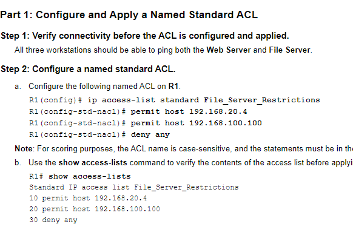

# Cheat sheet Computer Netwerken III


## OSPF: Open Shortest Path First

| Commando                 | Betekenis               |
| ------------------------ | ----------------------- |
| `show ip ospf neighbor`  | Toon de OSPF buren      |
| `show ip ospf interface` | Toon de OSPF interfaces |
| `ip ospf cost`           | De kost instellen       |


OSPF opzetten:

Stappen om OSPF op te zetten:
1. Start OSPF proces met een router ID
2. Definieer de netwerken die OSPF moeten gebruiken
3. Stel de OSPF kost in indien nodig
4. Controleer de OSPF buren en interfaces
5. Controleer de OSPF routing tabel

De wildcard kan je betpalen aan de hand van de subnetten die zijn aangesloten op de router. De wildcard is het omgekeerde van het subnetmasker.

| CIDR (Prefix) | Subnetmasker    | Wildcardmasker (inverse) |
| ------------- | --------------- | ------------------------ |
| /8            | 255.0.0.0       | 0.255.255.255            |
| /16           | 255.255.0.0     | 0.0.255.255              |
| /24           | 255.255.255.0   | 0.0.0.255                |
| /25           | 255.255.255.128 | 0.0.0.127                |
| /26           | 255.255.255.192 | 0.0.0.63                 |
| /27           | 255.255.255.224 | 0.0.0.31                 |
| /28           | 255.255.255.240 | 0.0.0.15                 |
| /29           | 255.255.255.248 | 0.0.0.7                  |
| /30           | 255.255.255.252 | 0.0.0.3                  |
| /31           | 255.255.255.254 | 0.0.0.1                  |
| /32           | 255.255.255.255 | 0.0.0.0                  |


| Commando                                                                               | Betekenis                                                                            |
| -------------------------------------------------------------------------------------- | ------------------------------------------------------------------------------------ |
| `router ospf 10`                                                                       | Start OSPF proces 10                                                                 |
| `router-id 6.6.6.6`                                                                    | Stel de router ID in                                                                 |
| `network 10.0.0.0 0.0.0.3 area 0 `                                                     | Stel de inverse maskers in voor alle aangesloten subnetten                           |
| `interface GigabitEthernet0/0/0`                                                       | Ga naar de interface configuratie modus voor GigabitEthernet0/0/0                    |
| `ip ospf 10 area 0`                                                                    | Activeer OSPF op de interfaces                                                       |
| `passive-interface GigabitEthernet0/0/0`                                               | Maak interface passief (geen routing updates naar netwerken waar ze niet nodig zijn) |
| `BC-1(config-if)#ip ospf priority 255`                                                 | De prioriteit van een interface instellen  (in dit voorbeeld op het max)             |
| `BC-1(config)#ip route 0.0.0.0 0.0.0.0 Serial0/1/1`                                    | Default route naar de ISP cloud                                                      |
| `BC-1(config)#router ospf 10 BC-1(config-router)#default-information originate`        | Automatisch de default route naar alle routers in het netwerk verdelen               |
| `P2P-1(config)#router ospf 10 P2P-1(config-router)#auto-cost reference-bandwidth 1000` | Automatisch de kost instellen afhankelijk van het type verbinding (Fe of Ge)         |
| `ip ospf cost 50`                                                                      | Kost voor een interface instellen                                                    |
| `ip ospf hello-interval 20`                                                            | Hello op standaard waarde zetten                                                     |
| `ip ospf dead-interval 80`                                                             | Dead op standaard waarde zetten                                                      |


## ACL Cheat Sheet (Cisco IOS)

### ACL Soorten
| Type         | Beschrijving                                          |
| ------------ | ----------------------------------------------------- |
| **Standard** | Filtert op **bron-IP**                                |
| **Extended** | Filtert op **bron + bestemming + protocol + poorten** |


##  Syntax

### Standard ACL
```bash
access-list <nummer 1-99> permit|deny <bron-ip> <wildcard-mask>
```
Voorbeeld:
```bash
access-list 10 deny 192.168.1.0 0.0.0.255
access-list 10 permit any
```
 Blokkeert verkeer van 192.168.1.0/24, laat de rest toe.
### Extended ACL
```bash
access-list <nummer 100-199> permit|deny <protocol> <bron-ip> <wildcard> [eq poort] <bestemming-ip> <wildcard> [eq poort]
```

Voorbeeld:
```bash
access-list 110 permit tcp 192.168.1.0 0.0.0.255 any eq 80
```

Laat HTTP-verkeer toe van 192.168.1.0/24 naar alle bestemmingen.
### Toepassen van ACL
⬅️ Ingress (incoming verkeer)
```bash
interface g0/0
ip access-group 10 in
```

➡️ Egress (outgoing verkeer)
```bash
interface g0/1
ip access-group 110 out
```
| Commando                                                                          | Betekenis                                              |
| --------------------------------------------------------------------------------- | ------------------------------------------------------ |
| `access-list 100 permit tcp 172.22.34.64 0.0.0.31 host 172.22.34.62 eq ftp`       | Toestaan van FTP verkeer van een subnet naar een host  |
| `R1(config)# access-list 100 permit icmp 172.22.34.64 0.0.0.31 host 172.22.34.62` | Toestaan van ICMP verkeer van een subnet naar een host |
| `R1(config)# access-list 100 deny ip any any`                                     | Blokkeer al het andere verkeer                         |
| `R1(config)# interface FastEthernet0/0`                                           | Ga naar de interface configuratie modus                |
| `R1(config-if)#ip access-group 100 in`                                            | Pas de ACL toe op de interface voor inkomend verkeer   |
| `R1(config-if)#ip access-group 100 out`                                           | Pas de ACL toe op de interface voor uitgaand verkeer   |
| `show access-lists`                                                               | Toon alle huidige ACLs                                 |




NAT configureren voor IPv4:

ACL configureren zodat vertaling kan gebeuren:
```bash
R2(config)#ip access-list standard R2NAT
R2(config-std-nacl)#permit 192.168.10.0 0.0.0.255
R2(config-std-nacl)#permit 192.168.20.0 0.0.0.255
R2(config-std-nacl)#permit 192.168.30.0 0.0.0.255
```

Een NAT pool configureren:
```bash
R2(config)#ip nat pool R2POOL 209.165.202.129 209.165.202.129 netmask 255.255.255.252
```
Nat configureren met de pool en ACL:
```bash
R2(config)#ip nat inside source list R2NAT pool R2POOL overload
```
De statische NAT map configureren voor de local.pka server
```bash
R2(config)#ip nat inside source static 192.168.20.254 209.165.202.130
```
NAT configureren op de interfaces:
```bash
R2(config)#interface FastEthernet0/0
R2(config-if)#ip nat inside
R2(config-if)#interface Serial0/0/0
R2(config-if)#ip nat inside
R2(config-if)#interface Serial0/0/1
R2(config-if)#ip nat inside
R2(config-if)#interface Serial0/1/0
R2(config-if)#ip nat outside
```
Ip nat inside is voor de interne interfaces, ip nat outside voor de externe interfaces.


## Enkele belangrijke commandos om te onthouden
| Commando                                            | Betekenis                                         |
| --------------------------------------------------- | ------------------------------------------------- |
| `show ip route`                                     | Toon de routing tabel                             |
| `hostname Router`                                   | Stel de hostnaam van de router in                 |
| `ip domain-name jouwdomein.be`                      | Stel de domeinnaam in voor de router              |
| `crypto key generate rsa general-keys modulus 1024` | Genereer RSA-sleutels voor SSH (1024 bits)        |
| `username admin password cisco`                     | Maak een gebruiker 'admin' met wachtwoord 'cisco' |
| `line vty 0 4`                                      | Ga naar de VTY-lijnen (voor remote toegang)       |
| `transport input ssh`                               | Sta alleen SSH toe voor remote toegang            |
| `login local`                                       | Gebruik lokale gebruikersdatabase voor login      |

## Belangrijke show commando's
| Doel                         | Commando                                            |
| ---------------------------- | --------------------------------------------------- |
| NAT-translatie tonen         | `show ip nat translations`                          |
| ACL-matches tonen            | `show access-lists`                                 |
| OSPF interfaces en neighbors | `show ip ospf interface`<br>`show ip ospf neighbor` |
| Routing tabel tonen          | `show ip route`                                     |
| IP-instellingen              | `show ip interface brief`                           |
| Gebruikers op VTY            | `show users`                                        |
| NAT statistieken             | `show ip nat statistics`                            |
| Op welke waarde staan dead en hello interval | `show ip ospf interface`                            |

### Oefenexamen packet tracer
Doe al deze stappen op alle routers die nodig zijn om OSPF te configureren:
1. Activeer OSPF:

```bash
BD-1(config)#router ospf 10
BD-1(config-router)#exit
BD-1(config)#
BD-1(config)#interface g0/0/0
BD-1(config-if)#ip ospf 10 area 0
BD-1(config-if)#interface s0/1/0
BD-1(config-if)#ip ospf 10 area 0
BD-1(config-if)#exit
```

2. Activeer OSPF met netwerk en wildcard:

```bash
PP-1(config)#router ospf 10
PP-1(config-router)#network 10.10.0.240 0.0.0.3 area 0
PP-1(config-router)#network 10.10.0.236 0.0.0.3 area 0
PP-1(config-router)#network 10.10.0.248 0.0.0.3 area 0
PP-1(config-router)#exit
```
3. Configureer de router ID:

```bash
BD-1(config)#router ospf 10
BD-1(config-router)#router-id 9.9.9.9
BD-1(config-router)#exit
```
4. Extra OSPF configuraties:

Verander de OSPF prioriteit van een interface:
Voor de hoogste prioriteit (255) en de laagste (0):
```bash
BD-1(config)#interface g0/0/0
BD-1(config-if)#ip ospf priority 10
BD-1(config-if)#exit
```
Een default route naar de ISP cloud:
```bash
BD-1(config)#ip route 0.0.0.0 0.0.0.0 s0/1/1
```

De default route naar alle routers in het netwerk verdelen:
```bash
BD-1(config)#router ospf 10
BD-1(config-router)#default-information originate 
BD-1(config-router)#exit
```
De hello en dead interval op de standaard waarde zetten:
```bash
BD-1(config)#interface g0/0/0
BD-1(config-if)#ip ospf hello-interval 10
BD-1(config-if)#ip ospf dead-interval 40
BD-1(config-if)#exit
```
De default kost instellen afhankelijk van het type verbinding (FastEthernet of GigabitEthernet):
```bash
BD-1(config)#router ospf 10
BD-1(config-router)#auto-cost reference-bandwidth 10000
BD-1(config-router)#exit
```
OSPF instellen zodat router updates niet naar netwerken worden gestuurd waar ze niet nodig zijn: 
```bash
BD-1(config)#router ospf 10
BD-1(config-router)#passive-interface s0/1/1
BD-1(config-router)#exit
```
5. Static NAT configureren:

Configure static NAT to translate the address of the Internal Server on LAN-1 to the public address of 192.0.2.115. Verify that the translations are occurring.
```bash
BD-1(config)#ip nat inside source static 192.168.11.100 192.0.2.115
BD-1(config)#int s0/1/1
BD-1(config-if)#ip nat outside 
BD-1(config-if)#int g0/0/0
BD-1(config-if)#ip nat inside 
BD-1(config-if)#exit
```
6. Dynamische PAT configureren:
```bash
BD-1(config)#access-list 1 permit 192.168.0.0 0.0.255.255
BD-1(config)#ip nat pool POOL-1 192.0.2.116 192.0.2.118 netmask 255.255.255.248
BD-1(config)#ip nat inside source list 1 pool POOL-1 overload 
BD-1(config)#int s0/1/0
BD-1(config-if)#ip nat inside
BD-1(config-if)#exit
```

7. ACLs configureren:
ACL voor de telnet lijnen om alleen toegang toe te staan van het netwerk
```bash
BD-1(config)#ip access-list standard VTY-BLOCK
BD-1(config-std-nacl)#permit 192.168.0.0 0.0.255.255
BD-1(config-std-nacl)#deny any
BD-1(config-std-nacl)#exit
BD-1(config)#line vty 0 4
BD-1(config-line)#access-class VTY-BLOCK in
BD-1(config-line)#exit
BD-1(config)#ip access-list extended BLOCK-SSH
```
ACL om ervoor te zorgen dat er van LAN1 naar LAN 2 geen verkeer mogelijk is:
```bash
BD-3(config)#access-list 10 deny 192.168.11.0 0.0.0.255
BD-3(config)#access-list 10 permit any
BD-3(config)#int g0/0/1
BD-3(config-if)#ip access-group 10 in
BD-3(config-if)#exit
```
## Bepalen van het Netwerkadres op basis van IP en Subnet

Het netwerkadres is het **eerste adres** in een subnet. Het identificeert het subnet zelf. Alle apparaten in dat subnet delen dit netwerkadres.

---

## Stappenplan

### Voorbeeld
- **IP-adres**: `192.168.12.34`  
- **Subnetmasker**: `255.255.255.0` (oftewel /24)

---

### Stap 1: Zet IP en subnetmasker om naar binair

#### IP-adres:

192 .168 .12 .34
11000000.10101000.00001100.00100010


#### Subnetmasker (255.255.255.0):

11111111.11111111.11111111.00000000


---

### Stap 2: Voer een **bitwise AND**-operatie uit  
(*1 AND 1 = 1, alles anders = 0*)

IP: 11000000.10101000.00001100.00100010
Mask: 11111111.11111111.11111111.00000000
Result: 11000000.10101000.00001100.00000000


---

### Stap 3: Zet het resultaat terug naar decimale notatie

11000000 = 192
10101000 = 168
00001100 = 12
00000000 = 0

**Netwerkadres = `192.168.12.0`**

---

## Alternatief: Met CIDR-notatie (/)

**Voorbeeld:** `10.0.5.129/20`

1. `/20` betekent: de eerste 20 bits zijn voor het netwerk  
2. Subnetmasker = `255.255.240.0`  
3. Subnetblokken zijn van 16 in het derde octet (`240 = 11110000`)  
4. Zoek dichtste veelvoud van 16 kleiner dan 5 → dat is **0**  
 **Netwerkadres = `10.0.0.0/20`**

---

